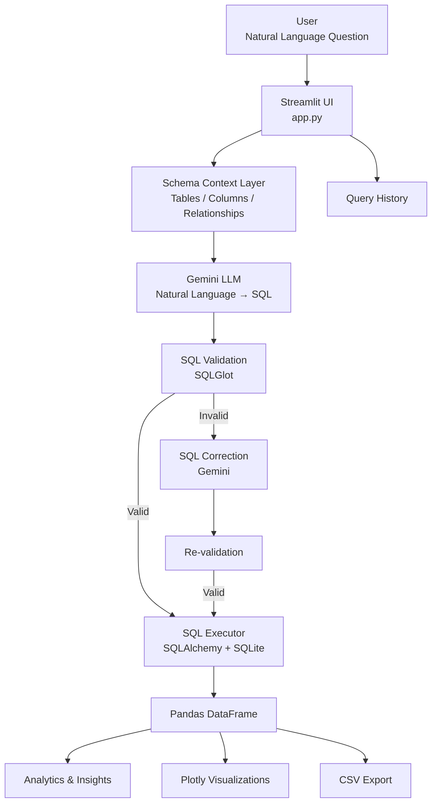

# QueryMind AI

### Natural Language → SQL Analytics Assistant

QueryMind AI is an AI-powered analytics application that allows users to ask questions about a relational database in plain English and receive validated SQL queries, query results, insights, and interactive visualizations.

The project combines **Gemini**, **Streamlit**, **SQLAlchemy**, **SQLGlot**, **SQLite**, **Pandas**, and **Plotly** into a modular Natural Language-to-SQL workflow.

---

## ✨ Features

- 🧠 **Natural Language to SQL**
  - Ask database questions using everyday language.
  - Gemini generates SQL using database schema context.

- 🗂️ **Database Schema Explorer**
  - Browse available tables.
  - Inspect columns and table details.
  - Explore database relationships.

- ✅ **SQL Validation**
  - Generated SQL is parsed and validated before execution.
  - SQLGlot is used for SQL parsing and validation.

- 🔧 **Automatic SQL Correction**
  - If generated SQL fails during execution, QueryMind AI can send the error back to the correction workflow and generate a corrected query.
  - The corrected SQL is validated again before execution.

- ⚡ **Safe Query Execution**
  - Validated queries are executed against the SQLite database through SQLAlchemy.

- 📊 **Automatic Analytics**
  - Result row and column counts.
  - Missing-value analysis.
  - Numeric summaries.
  - Automatically generated observations.

- 📈 **Interactive Visualizations**
  - Plotly-based charts generated from suitable query results.

- 📥 **CSV Export**
  - Download query results for further analysis.

- 🕘 **Query History**
  - Review queries generated during the current application session.

- 🧪 **Automated Testing**
  - Pytest tests cover database exploration, SQL validation, SQL correction, and analytics components.

---

## 🏗️ Architecture



### Workflow

1. The user enters a question in natural language.
2. QueryMind AI retrieves the relevant database schema context.
3. Gemini generates a SQL query based on the schema.
4. SQLGlot parses and validates the generated SQL.
5. If the query is invalid or execution fails, the correction workflow attempts to generate a corrected query.
6. The corrected SQL is validated again.
7. Valid SQL is executed against the SQLite database.
8. Results are loaded into a Pandas DataFrame.
9. QueryMind AI generates basic analytics and suitable visualizations.
10. Results can be exported as CSV.

---

## 🛠️ Tech Stack

| Technology | Purpose |
|---|---|
| Python | Core application development |
| Streamlit | Interactive web application |
| Gemini | Natural Language-to-SQL generation and correction |
| SQLite | Sample relational database |
| SQLAlchemy | Database connection and SQL execution |
| SQLGlot | SQL parsing and validation |
| Pandas | Result processing and analytics |
| Plotly | Interactive data visualization |
| Pytest | Automated testing |
| python-dotenv | Environment variable management |

---

## 📁 Project Structure

```text
QueryMind AI/
│
├── analytics/
│   ├── insights.py
│   └── visualizer.py
│
├── config/
│   └── settings.py
│
├── database/
│   ├── connection.py
│   ├── schema.py
│   ├── explorer.py
│   └── chinook.db
│
├── data/
│   └── samplequestions.json
│
├── llm/
│   ├── client.py
│   ├── prompts.py
│   ├── schema_context.py
│   ├── sql_generator.py
│   ├── sql_corrector.py
│   └── test_llm.py
│
├── sql/
│   ├── validator.py
│   ├── formatter.py
│   └── executor.py
│
├── tests/
│   ├── test_database_explorer.py
│   ├── test_sql_validator.py
│   ├── test_sql_corrector.py
│   ├── test_sql_correction_live.py
│   └── test_analytics.py
│
├── utils/
│   ├── helpers.py
│   └── logger.py
│
├── app.py
├── requirements.txt
├── .env.example
├── .gitignore
└── README.md
```

---

## 🚀 Getting Started

### 1. Clone the repository

```bash
git clone https://github.com/Shivanshu659/QueryMind-AI.git
cd QueryMind-AI
```

> Replace the repository URL with the final GitHub repository URL if the repository name is different.

### 2. Create a virtual environment

Windows:

```bash
python -m venv .venv
.venv\Scripts\activate
```

macOS/Linux:

```bash
python3 -m venv .venv
source .venv/bin/activate
```

### 3. Install dependencies

```bash
pip install -r requirements.txt
```

### 4. Configure the Gemini API

Create a `.env` file in the project root:

```env
GOOGLE_API_KEY=your_google_api_key
GEMINI_MODEL=gemini-2.5-flash
```

Do **not** commit `.env` or your API key to GitHub.

The repository should contain `.env.example` instead:

```env
GOOGLE_API_KEY=
GEMINI_MODEL=gemini-2.5-flash
```

### 5. Run the application

```bash
streamlit run app.py
```

The application will open in your browser.

---

## 🧪 Testing

Run the complete test suite:

```bash
pytest -v
```

You can also run individual test modules:

```bash
pytest tests/test_sql_validator.py -v
```

```bash
pytest tests/test_database_explorer.py -v
```

```bash
pytest tests/test_analytics.py -v
```

The project also contains tests for the SQL correction workflow.

---

## 🔐 Configuration & Security

API credentials are loaded through environment variables.

The `.gitignore` file should prevent local secrets, virtual environments, logs, and Python cache files from being committed.

Example:

```gitignore
.env
.env.*
!.env.example

.venv/
__pycache__/
.pytest_cache/

logs/
*.log
```

Never place a real API key directly inside Python source code.

---

## 🗃️ Database

QueryMind AI currently uses the **Chinook SQLite sample database**.

The database is used to demonstrate Natural Language-to-SQL capabilities across related entities such as:

- Artists
- Albums
- Tracks
- Customers
- Employees
- Invoices
- Genres
- and related tables

The application provides database exploration and relationship information before generating queries.

---

## 💡 Example Questions

Users can ask questions such as:

```text
Show me the names of all artists.
```

```text
How many artists are there?
```

```text
Show the 10 longest tracks.
```

```text
Show all customers from Canada.
```

```text
Which countries have the most customers?
```

```text
Which customers have spent the most money?
```

```text
How many tracks belong to each genre?
```

```text
What is the total revenue generated?
```

The generated SQL is displayed before execution so the user can inspect the query.

---

## 🔄 SQL Correction Workflow

One of the key design decisions in QueryMind AI is that generated SQL is **not treated as automatically correct**.

The workflow is:

```text
Natural Language Question
          ↓
      Gemini
          ↓
    Generated SQL
          ↓
     SQLGlot
          ↓
    Validation
      ↙     ↘
 Invalid    Valid
   ↓          ↓
Gemini      Execute
Correction    ↓
   ↓       DataFrame
Re-validate    ↓
   ↓       Analytics
 Execute        ↓
             Charts
```

This helps handle situations where an LLM-generated query contains an incorrect column name, table reference, or SQL structure.

---

## 📊 Analytics Layer

After successful execution, query results are processed with Pandas.

The analytics layer can provide:

- Number of returned rows
- Number of columns
- Numeric columns
- Categorical columns
- Missing-value count
- Basic numeric summaries
- Automatic observations

When the returned data is suitable, Plotly visualizations can also be generated.

---

## 🎯 Project Goals

QueryMind AI was built to demonstrate practical skills in:

- Generative AI application development
- Natural Language-to-SQL systems
- Database exploration
- Prompt-based SQL generation
- SQL validation
- LLM error correction
- Data analytics
- Data visualization
- Python application architecture
- Automated testing

---

## 🔮 Future Improvements

Potential future enhancements include:

- Support for PostgreSQL and MySQL
- More advanced schema-aware retrieval
- Improved SQL benchmarking
- Query performance analysis
- User authentication
- Saved query collections
- More advanced automated insights
- Custom database connection support
- Production deployment with persistent query history
- Evaluation of generated SQL against benchmark questions

---

## 👨‍💻 Author

**Shivanshu**

MCA | Data Analytics | Python | SQL | Power BI

GitHub: `Shivanshu659`

---

## 📌 Repository Description

Use this as the GitHub repository description:

> AI-powered Natural Language-to-SQL analytics assistant built with Python, Gemini, Streamlit, SQLGlot, SQLite, Pandas and Plotly.

### Recommended GitHub Topics

```text
python
streamlit
gemini
generative-ai
natural-language-to-sql
text-to-sql
sql
sqlite
sqlalchemy
sqlglot
pandas
plotly
data-analytics
llm
```

---

## ⭐ Project Highlights

> **QueryMind AI converts natural-language questions into validated SQL, executes them against a relational database, and transforms the results into useful analytics and interactive visualizations.**

The project demonstrates how a probabilistic LLM can be combined with deterministic database validation, execution, and analytics components to build a more reliable AI-powered data application.
